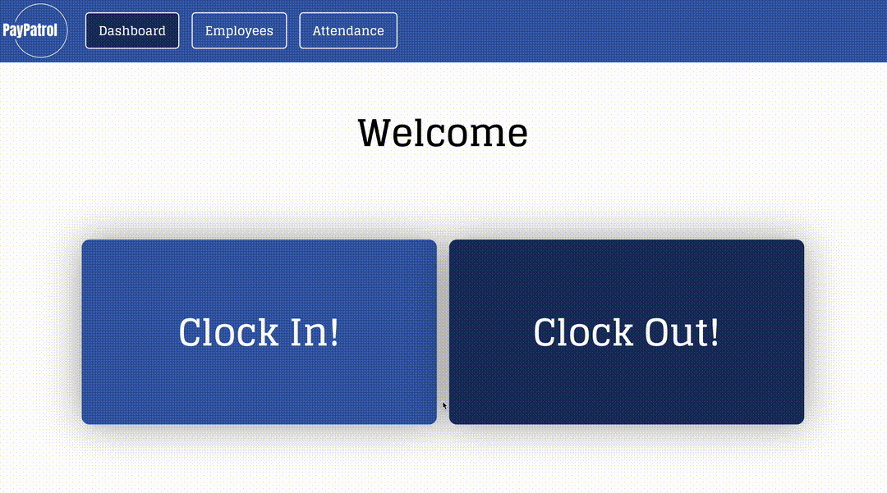
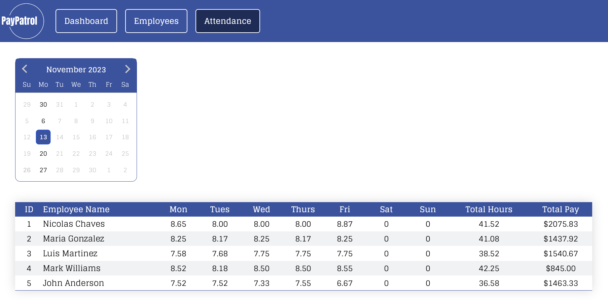

  
# PayPatrol

 
 ## Current Version
 ### Employee Clock In or Out
 This section provides employees with the capability to conveniently clock in/out using their unique QR Employee Badges.
 

### Manager Employee Dashboard
The Manager Employee Dashboard offers real-time oversight of employee attendance and provides access to employee information. Managers can easily edit, delete, or add new employees on the fly.
 

 ### Manager Weekly Calendar Dashboard
The Manager Weekly Calendar Dashboard displays daily work hours, calculates the total weekly hours, and determines payment based on the hourly rate and total hours worked.
 
 

## Overview

What is your app? Brief description in a couple of sentences.

The app is a time tracking and attendance management application that allows employees to clock in and out of work using a QR code reader. It also provides a feature to display the weekly hours worked by each employee and calculates their corresponding wages, making it easier for management to determine how much to pay each employee.

  

### Problem

Why is your app needed? Background information around any pain points or other reasons.

The app is needed to address the time tracking and attendance management challenges faced by small businesses that haven't yet implemented HR or payroll solutions. Many small businesses currently rely on manual methods, which can lead to chaotic record-keeping and be time-consuming. This app aims to streamline the process, making it more efficient and less prone to errors or data loss, ultimately saving businesses time and resources.

  

### User Profile

Who will use your app? How will they use it? 
Small Business Owners/Managers: Small business owners or managers will be the primary users of the app. They will use it to track the attendance and working hours of their employees, generate reports, and calculate wages.

  

### Features

1.  **QR Code Clock-In/Clock-Out:** Employees can easily mark their attendance and working hours.
2.  **Automated Hours Tracking:** The app tracks and displays weekly hours worked by each employee.
3.  **Wage Calculation:** Automatic calculation of wages based on tracked hours and set pay rates.
4.  **User-Friendly Interface:** Designed for ease of use, requiring minimal training for employees and managers.

## Work In Progress

**Excel Exporting**: Exporting data to excel for managers.
**Authentication** : Login for Managers and Employees.
**Additional Languages**: More Languages will be used to make the website public.
