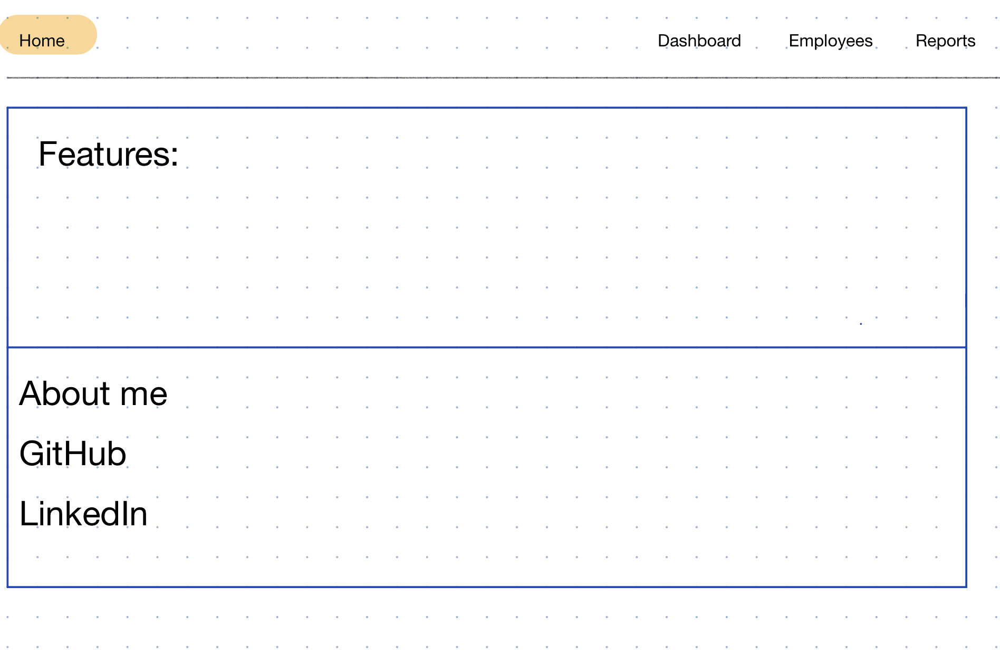
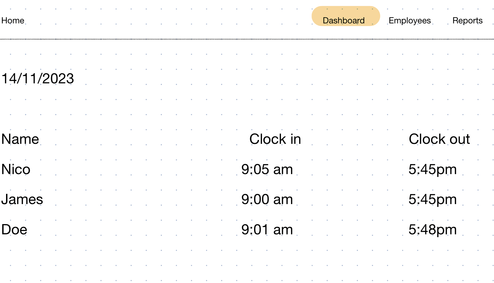
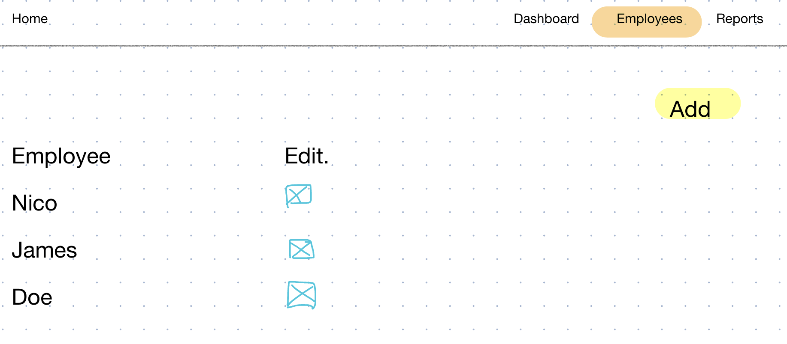
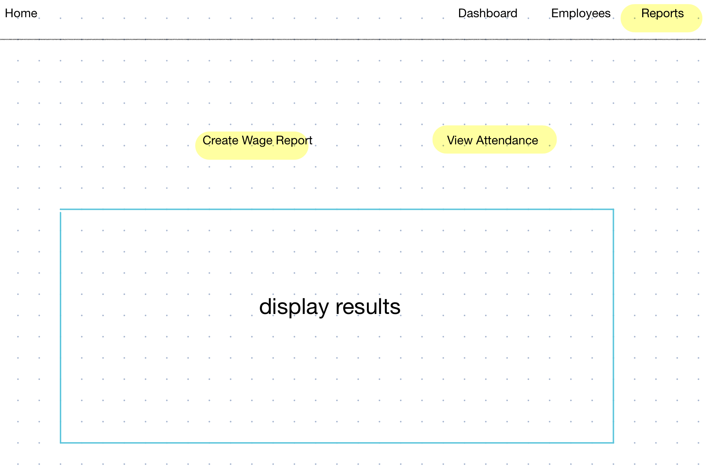

# Project Title
PayPatrol
  

## Overview

What is your app? Brief description in a couple of sentences.

The app is a time tracking and attendance management application that allows employees to clock in and out of work using a QR code reader. It also provides a feature to display the weekly hours worked by each employee and calculates their corresponding wages, making it easier for management to determine how much to pay each employee.

  

### Problem

Why is your app needed? Background information around any pain points or other reasons.

The app is needed to address the time tracking and attendance management challenges faced by small businesses that haven't yet implemented HR or payroll solutions. Many small businesses currently rely on manual methods, including my experience as project manager having employees write down their hours in a payroll binder, which can lead to chaotic record-keeping and potential issues like lost binders. This app aims to streamline the process, making it more efficient and less prone to errors or data loss, ultimately saving businesses time and resources.

  

### User Profile

Who will use your app? How will they use it? Any special considerations that your app must take into account.

Small Business Owners/Managers: Small business owners or managers will be the primary users of the app. They will use it to track the attendance and working hours of their employees, generate reports, and calculate wages.

  

### Features

List the functionality that your app will include. These can be written as user stories or descriptions with related details. Do not describe _how_ these features are implemented, only _what_ needs to be implemented.

1.  **QR Code Clock-In/Clock-Out:** Employees can easily mark their attendance and working hours.
2.  **Automated Hours Tracking:** The app tracks and displays weekly hours worked by each employee.
3.  **Wage Calculation:** Automatic calculation of wages based on tracked hours and set pay rates.
4.  **User-Friendly Interface:** Designed for ease of use, requiring minimal training for employees and managers.

## Implementation

### Tech Stack
List technologies that will be used in your app, including any libraries to save time or provide more functionality. Be sure to research any potential limitations.
-   **Frontend:** React for a cross-platform mobile app.
-   **Backend:** Node.js with Express for server-side logic.
-   **Database:** Knex and SQL for storing employee data, hours, and wages.
-   **QR Code Generation/Reading:** Integration of a QR code library for generating and reading QR codes.
  

### APIs
List any external sources of data that will be used in your app.
**QR Code API:** For generating and scanning QR codes.
  

### Sitemap
List the pages of your app with brief descriptions. You can show this visually, or write it out.
1.  **Home Page:** Overview of the application features.
2.  **Dashboard:** Real-time attendance tracking and hours logged.
3.  **Employee Management:** Add/edit employee details.
4.  **Reports:** Generate and view attendance and wage reports.
  

### Mockups
Provide visuals of your app's screens. You can use tools like Figma or pictures of hand-drawn sketches.

  

### Data
Describe your data and the relationships between them. You can show this visually using diagrams, or write it out.
-   **Employee Data:** Personal details, hourly rate, and login information.
-   **Attendance Records:** Date, time, and duration of each employee's work hours.
-   **Wage Data:** Calculated based on attendance records and hourly rates.
  

### Endpoints
List endpoints that your server will implement, including HTTP methods, parameters, and example responses.
-   **/employees:** GET to retrieve employee details, POST to add a new employee.
-   **/attendance:** GET to retrieve attendance data, POST for clocking in/out.
-   **/reports:** GET to generate and retrieve reports.
  

## Roadmap

Scope your project as a sprint. Break down the tasks that will need to be completed and map out timeframes for implementation. Think about what you can reasonably complete before the due date. The more detail you provide, the easier it will be to build.
1.  **Goal 1:** Setting up the project structure and database.
2.  **Goal 2:** Developing the QR code clock-in/clock-out functionality.
3.  **Goal 3:** Implementing the wage calculation and report generation features.
4.  **Goal 4:** Finalizing the user interface and testing.
  

## Nice-to-haves
Your project will be marked based on what you committed to in the above document. Under nice-to-haves, you can list any additional features you may complete if you have extra time, or after finishing.

**Excel Exporting**: Exporting data to excel for managers.
**Authentication** : Login for Managers and Employees.